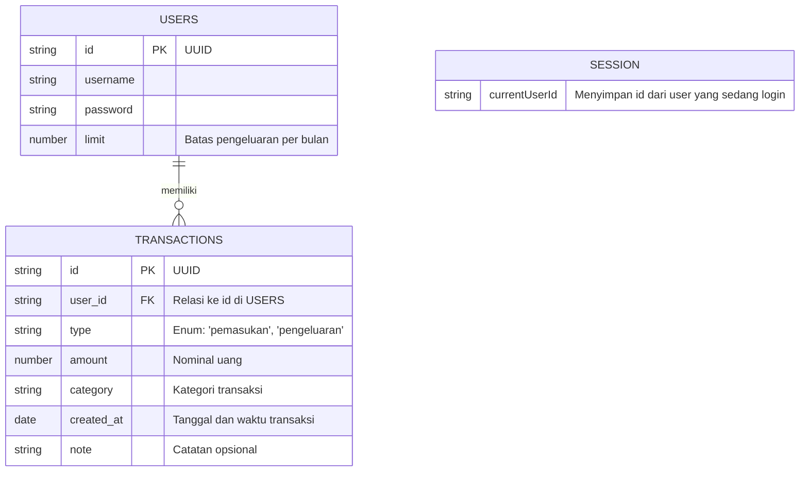

# Skema Database Local Storage (ERD)

Meskipun aplikasi tidak menggunakan sistem database backend seperti MySQL atau PostgreSQL, data akan distruktur dan dikelola di dalam browser `localStorage` seolah-olah itu adalah database NoSQL/Dokumen. 

Berikut adalah desain Entity Relationship Diagram (ERD) dari struktur data yang akan disimpan dalam format JSON di `localStorage`.



## Daftar Local Storage Keys
1. **`fintjam_users`**
   - Tipe Data: Array of Object `[]`
   - Keterangan: Berisi kumpulan semua data user yang mendaftar.
   - Contoh Data:
     ```json
     [
       {
         "id": "u1",
         "username": "budi123",
         "password": "password123",
         "limit": 5000000
       }
     ]
     ```

2. **`fintjam_currentUser`**
   - Tipe Data: String
   - Keterangan: Berfungsi sebagai session token. Jika ada isi, maka user dianggap sudah login. Nilainya merujuk pada `id` di `fintjam_users`.
   - Contoh Data: `"u1"`

3. **`fintjam_transactions`**
   - Tipe Data: Array of Object `[]`
   - Keterangan: Berisi semua data transaksi dari seluruh user. (Data akan difilter berdasarkan `user_id` saat ditampilkan).
   - Kategori yang diizinkan: 
     - "Makanan & Minuman"
     - "Transportasi"
     - "Belanja"
     - "Gaji / Pendapatan"
     - "Investasi"
     - "Temen Ngutang"
   - Contoh Data:
     ```json
     [
       {
         "id": "t1",
         "user_id": "u1",
         "type": "pengeluaran",
         "amount": 50000,
         "category": "Makanan & Minuman",
         "created_at": "2024-05-09T10:00:00Z",
         "note": "Makan siang ayam geprek"
       }
     ]
     ```
